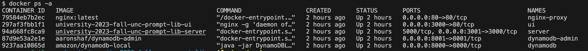
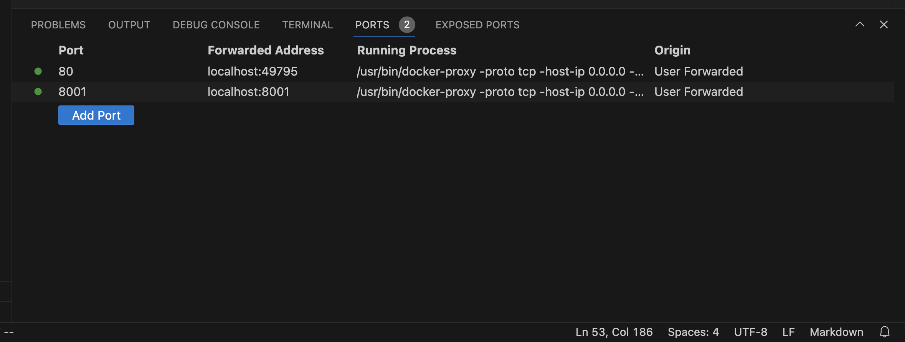

# README-aws.md

## Server access
Use `ssh` to access your project's designated EC2 instance. (Refer to previous email for corresponding IP address for each project.)

You can also use a vscode extension like "Remote Explorer" to connect via an IDE. This also gives you the ability to quickly map a port on the remote EC2 instance to a local port for access through your browser.

## Stop/start sample application
### Stop
```bash
$ cd ~/react-express-mysql
$ docker-compose down
```
### Start
```bash
$ cd ~/react-express-mysql
$ docker-compose up -d
```

## Run application
### Clone repository
```bash
$ cd
$ git clone https://github.com/Ally-Financial/university-2023-fall-unc-prompt-lib.git
```

### Startup the network
```bash
$ cd ~/university-2023-fall-unc-prompt-lib
$ git checkout feature/aws
$ docker-compose up -d
```

### View running network
The `docker-compose` program starts the network with 5 services.  Check the status by running `docker ps -a`.
```bash
$ docker ps -a
```


### Stop the network
```bash
$ cd ~/university-2023-fall-unc-prompt-lib
$ docker-compose down
```

### Rebuild applications
Changes made to the "server" application should be picked up automatically.  Any changes to the "ui" and "proxy" applications will require a docker build of those application to see the changes.  This is easily done by adding the `--build` flag to `docker-compose`.

```bash
$ cd ~/university-2023-fall-unc-prompt-lib
$ docker-compose up -d --build
```

### Local Access
In vscode with the "Remote Explorer" plugin, you can select the "PORTS" tab and the "Add Port" button. Key in the port number and a "Forwared Address" will be assigned.  Mapping port 80 will give you local access to the "proxy" server, and port 8001 will give you access to the "dynamodb-admin". For example,



### Remote Access
With your services running, you can access your application via the Application Load Balancer (ALB) URL given in an earlier email.  We've also included these URLs in the `README` file in the home directory of your EC2 server.
```bash
$ cat ~/README
```

### feature/aws branch merge
Merge the feature/aws branch back to your working branch or back to "main" if you chose to run on AWS.  This is not a requirement and you can always demo your application from localhost.